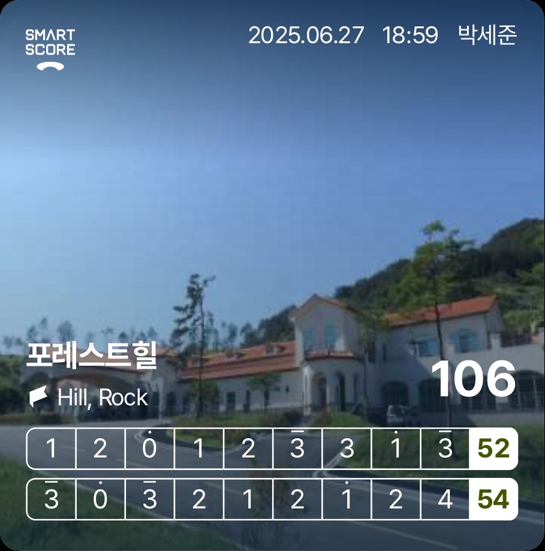

## 2025년 상반기

### 2025-06-27 포레스트힐(106)

> **"2번 죽으면 5온"**

- 역시나, 당연하지만 머리가 하얘져 연습쳐럼 못 치고, 연습때 고치려한 안좋은 수많은 내용들이 재발
- 아이언을 너무 쓸어친 날. 디봇이난 경우가 손에 꼽는다.
- 공을 정말 많이 잃어버린 날
  - 6번홀부터였나 한번 슬라이스 나기 시작하더니, 이후로 스핀아웃에 헤드가 계속 열린 것 같다.
  - 야간티라 해저드라 다행이지, OB였으면 점수가 몇배는 뛰었을 것 같다. 106타는 많이 잘 쳐준 점수 같다.
  - 아마 한 6번 홀부터 드라이버가 거의다 죽은 것 같다. 드라이버 죽고세컨샷도 죽는 경우가 허다했음. 이런 경우가 많아서 거의 가냥 외웠다. **"2번 죽으면 5온"**
    - 그래도 철푸덕은 2번 정도 있었나? 거의 없었던 것 같다. 죽더라도 공이 떠서 실력이 늘었다고 해야 하나

스코어카드

